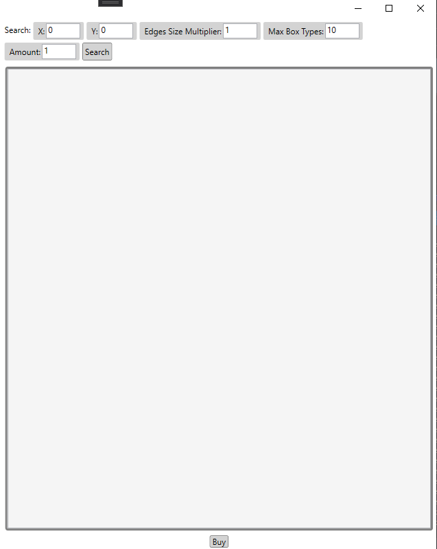
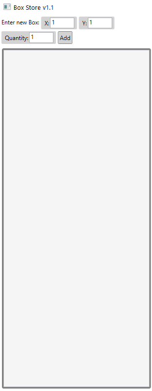

# Box Store Project WPF
### A Data Structure Class Project

This is a project I did for my data structure class. Main objective was to make the fastest and most efficient adding, searching and buying different boxes.

## Screenshots

## Technologies
 
### Architecture
- **Layered Architecture**
- **MVVM design pattern**

### Data Structures:
- **Linked List**
- **Queue**
- **Binary Search Tree**

### Application
- **WPF**
- **Entity Framework 6**
- **.NET Framework 4.8**

# Author 📝

-   **Ethan Shoham** - [LinkedIn](https://www.linkedin.com/in/ethan-shoham-13a40050/)
